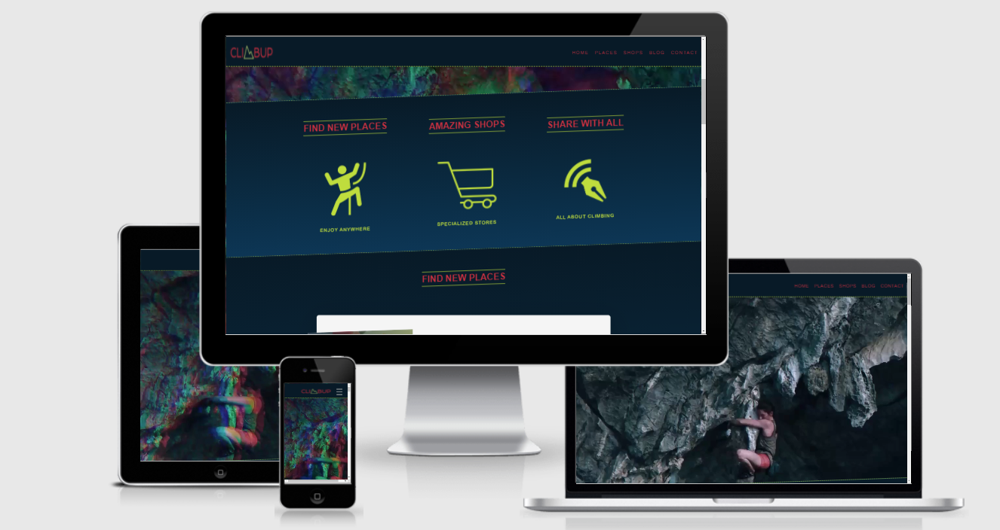
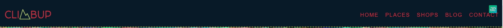
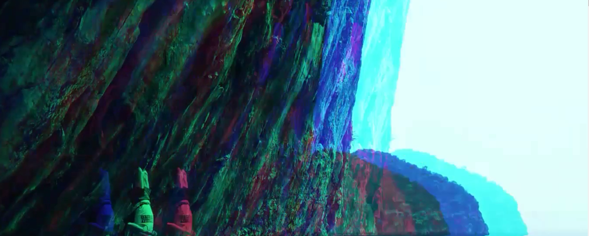
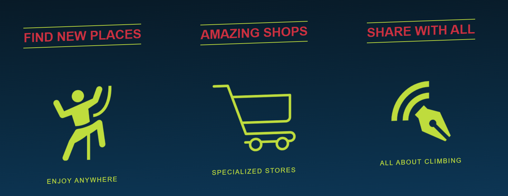
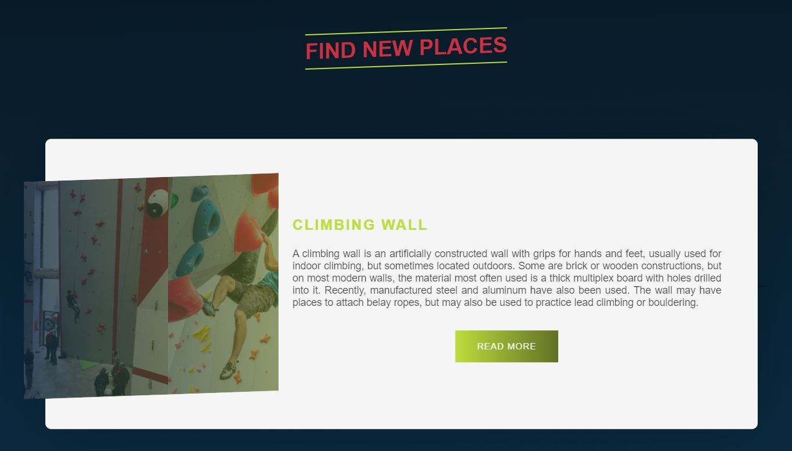

 # ClimbUp

It is a website for all those people who want to start climbing. On this page, you will find a section that will explain the difference between rock climbing and climbing wall.

You will also find another section with different climbing shops so that you can take a look at them and complete your equipment with quality materials.

Finally, you will find a blog in which we are uploading super interesting articles so that you can gradually learn more about this wonderful sport.

We have a form, where you can send us your messages in case you have any questions or want to share an experience with us and we will publish it on our blog.

[You can access the page through this link](https://alopmel.github.io/ClimbUp/)

## Features
This section explains the functionality of the different parts of the page to provide the user with a brief guide on how to use the page.
### Existing Features

* **Navigation**

  * On the left we can find the name of the page, it is a logo created in logomark. I used that set of colours because, in addition to creating a striking contrast between them, red refers to the earth and the green to nature. It is also a link that leads to the top of the page.
     
  * On the right side, you will find the rest of the links that take us to the different sections of the page. In this case, we have a home, places, shops, blog and contact. They appear with a progression from right to left, also when passing over them they have an animation where they appear underlined above and below. I used the colours of the logo to create harmony between the two.
     
  * The font I use is Roboto Cn and it is found on the rest of the page. The menu is fixed at the top, so when scrolling it will always stay in the same position, thus facilitating the user accessibility to the different sections.

* **Header**
 
  * The header consists of a video edited with Movavi Video. I edited a YouTube video from which I cut out the parts that interested me and put a filter on it with the same basic colours that I use for the web page; Blue, red and green.

* **Home**

  * By using a video as a header, I decided to create this post where the different sections of the page are displayed. It is a way of explaining better to the user that you will find below.

  * To create this section I made the logos in Logo Maker, each of them is a link that leads to the different sections of the website.

  * I used the logo colours on a gradient background and a transition where the elements appear from below.

* **Find New Places**

  * Finding new places is a section for the user to read articles about rock climbing, climbing walls and different places to practice climbing.

  * In this case, the articles have a slide that contains different photos related to the article. The button has a floating, gradient animation.

  
